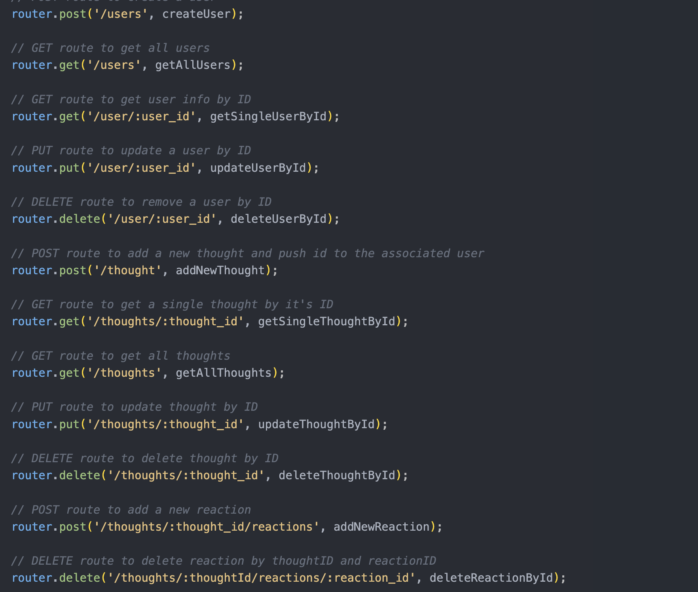
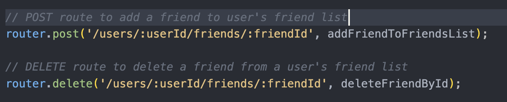

# Social Network App

## Table of Contents
- [Installation](#installation)
- [Usage](#usage)
- [Contributing](#contributing)
- [Tests](#tests)
- [Questions](#questions)
- [License](#license)

## Description
The social network app is used to create, manage, update, and delete users. Each user can add their own thoughts, and add other users as friends. Each thought can have reactions from other users added. You can also update existing users and thoughts. Users, thoughts, and reactions can be deleted from the database as well. You also can retrieve a list of users and thoughts, or search for one result by ID.

## Installation
You must run npm i to install all necessary dependencies. This app uses Express, Mongoose, and Bcrypt.ß

## Usage
[Video Walkthrough](https://drive.google.com/file/d/1v7uRZuK8D_df82IwUj6hY9KQhPhFQ52n/view?usp=drive_link)

In order to make API requests to the database, you can first view the api_routes.ts file to view all of your options. The note for each route's purpose is defined in a comment over the corresponding route. Please read each endpoint carefully to determine if you will need to populate the body and/or parameters in your request.

Screenshots with of the route information can be found below:

## Contributing
N/A

## Tests
N/A

## Questions
Message me on GitHub! [mcaiati2](https://github.com/mcaiati2)

## License
This project is listed under the MIT [License](https://opensource.org/licenses/MIT). You are free to use, modify, and distribute this software in accordance with the terms of the license. For more details, please refer to the LICENSE file in the repository.
